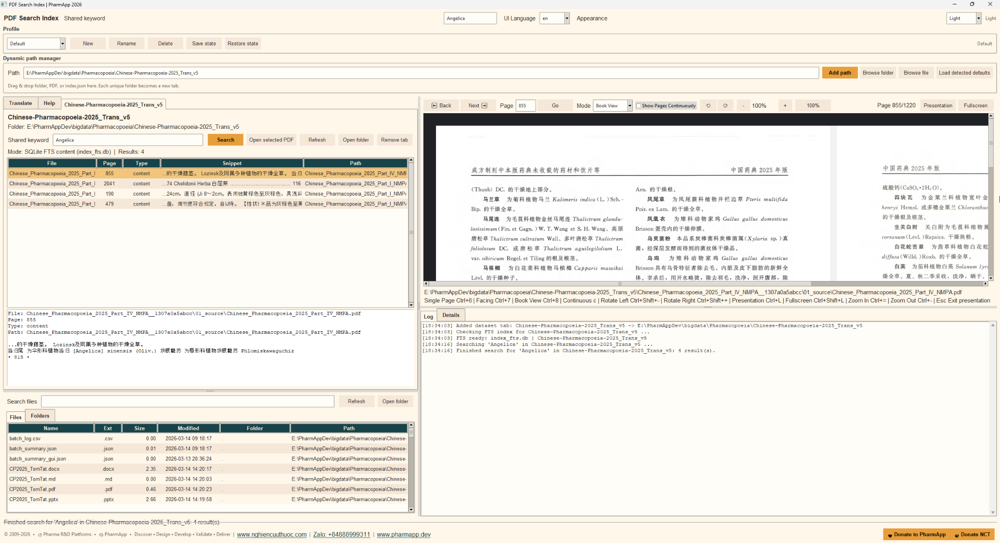

# PharmApp PDF Search Index v3 — End-User Guide

English Guide for End Users

Date: 2026-03-15

## 1. Introduction

PharmApp PDF Search Index v3 helps end users search indexed pharmaceutical PDF collections, open the matching file immediately, and review the exact page in an integrated PDF viewer.

The application is designed for large document libraries. In configured builds, it can use SQLite FTS for faster searching and may create an index_fts.db file automatically when a dataset is loaded or searched for the first time.

## 2. Main tasks you can do

Add a folder, a PDF file, or an index.json file and let the app open the related dataset tab automatically.

Search indexed content by keyword, inspect snippets in the result list, and open the corresponding PDF page.

Read PDFs in Single Page, Facing, Book View, or Continuous mode.

- Use Presentation and Fullscreen modes for review meetings or teaching sessions.
Translate terms or phrases and search translated PDF names.

Manage profiles to save and restore your working layout and dataset state.

Browse files and folders, open containing folders, and review activity in Log and Details panes.

## 3. Main interface areas

Header: shared keyword, UI language, and appearance controls.

Profile area: create, rename, delete, save, and restore profiles.

Dynamic path manager: type or browse a folder, PDF, or index.json. Drag and drop is also supported.

Dataset tab: search box, result grid, details panel, and actions such as Open selected PDF and Refresh.

PDF viewer: page navigation, view mode selection, zoom, rotation, continuous display, presentation, and fullscreen.

Explorer: browse files and folders in the current dataset.

Log and Details: review search activity, status messages, and metadata.

## 4. Quick start

- Step 1: Launch pdf_search_index_v3.exe.
- Step 2: In Dynamic path manager, paste a path or click Browse folder / Browse file.
- Step 3: Click Add path. A new dataset tab is created for each unique folder.
- Step 4: If the dataset has an index.json, the app may prepare or refresh index_fts.db automatically for faster search.
- Step 5: Enter a keyword in the dataset search box or Shared keyword, then click Search.
- Step 6: Click a result row to review the snippet. Double-check the page number and path.
- Step 7: Click Open selected PDF to jump directly to the matched PDF page in the viewer.

## 5. Search workflow

- Use Shared keyword when you want the same term to be reused across tabs or in the translation tool.
Search results usually show file name, page, type, snippet, and path.

If a fast FTS index is available, the app searches that index first. If not, it can fall back to index.json content or PDF file names, depending on the dataset.

If no results appear immediately on a new dataset, wait for background index preparation to finish and search again.

## 6. Using the PDF viewer

- Back / Next moves between pages.
Type a page number and click Go to jump to a specific page.

Mode lets you switch between Single Page, Facing, and Book View.

Show Pages Continuously displays a continuous reading flow.

- Rotate Left / Right rotates the rendered page image.
- Zoom controls let you zoom out, zoom in, or reset to 100%.
- Presentation opens a clean presentation window for page review.
- Fullscreen maximizes the viewer window.
Useful shortcuts shown in the viewer hint include mode changes, zoom, rotation, presentation, and fullscreen.

## 7. Translation, profiles, and explorer

- Use the Translate tab to translate a source term into a target language and search translated PDF names.
- Use profiles when different users or workflows need different open tabs, themes, and layout states.
- Use the Files and Folders explorer to inspect dataset contents and open containing folders.

## 8. Tips and troubleshooting

- Use short and precise search terms first, then expand if needed.
If search feels slow on a new dataset, let the background index creation finish.

If a PDF does not open, verify that the file still exists in the dataset folder.

Click Refresh after replacing, moving, or updating dataset files.

- Use Log and Details to confirm whether the app is using SQLite FTS, index.json, or filename fallback.

## 9. Support footer

© 2009-2026 • Pharma R&D Platforms • PharmApp • Discover • Design • Develop • Validate • Deliver | www.nghiencuuthuoc.com | Zalo: +84888999311 | www.pharmapp.dev

---
© 2009-2026 • Pharma R&D Platforms • PharmApp • Discover • Design • Develop • Validate • Deliver | www.nghiencuuthuoc.com | Zalo: +84888999311 | www.pharmapp.dev